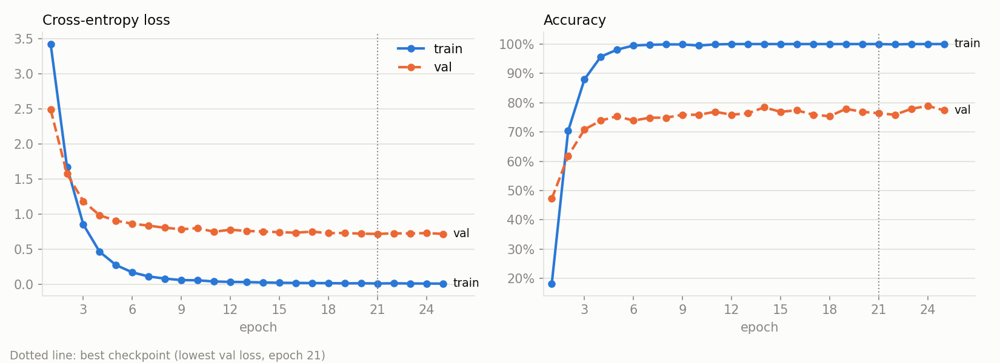

# Turkish Food Classifier: PyTorch from the Ground Up

A 47-class image classifier for Turkish dishes, built on a pretrained ResNet18
with a training loop written by hand in plain PyTorch. There is no `Trainer`,
no Lightning, and no Unsloth: every forward pass, loss, backward pass, and
optimizer step is visible in [`src/engine.py`](src/engine.py).

## Why this project

I had already fine-tuned a vision-language model (Qwen2-VL) with Unsloth,
transformers, and PEFT/LoRA. Those tools worked, but they hid the training
loop from me. The goal here was to open the hood: write each step myself,
run small experiments to see what each piece actually does, and understand
what the higher-level tools had been doing on my behalf.

## Results

Trained on a Kaggle T4 GPU. The full run, with logs and curves, is in the
[Kaggle notebook](https://www.kaggle.com/code/turhangksu/pytorch-food-classifier). Validation set: 199 images, a stratified 20% of
the data. 25 epochs, seed 42, batch size 32. The checkpoint is the epoch with
the lowest validation loss, and accuracy is reported at that epoch.

| Setup | Trainable params | Best val loss | Val accuracy | Notes |
|---|---:|---:|---:|---|
| Frozen backbone, new head only | 24,111 | 1.191 | 65.8% | Still slowly improving at epoch 25 |
| `layer4` unfrozen, one learning rate (1e-3) | 8.4M | 0.846 | 75.4% | Unstable after epoch 14 (local MPS run) |
| `layer4` unfrozen, head 1e-3 and `layer4` 1e-4 | 8.4M | **0.716** | **76.4%** | Smooth, default recommendation |

Local runs on Apple Silicon (MPS) with the same seed landed within about one
point of these numbers. With about 17 training images per class, the gap
between training accuracy (100%) and validation accuracy (about 76%) shows
that the model memorizes the training set. More data or stronger
augmentation would help more than more epochs.



## Architecture

```
JPEG, any size
  -> train: RandomResizedCrop(224), HorizontalFlip, brightness/contrast jitter
     val:   Resize(224, 224)
  -> ToTensor, Normalize(ImageNet mean/std)             [B, 3, 224, 224]
  -> ResNet18 backbone (ImageNet weights)
       conv1 -> layer1 -> layer2 -> layer3 -> layer4    frozen by default,
       -> global average pool                           layer4 optionally trained
                                                        [B, 512]
  -> fc: Linear(512 -> 47), new and trainable           [B, 47] logits
  -> CrossEntropyLoss (applies log-softmax internally)
```

Design decisions:

- **Custom `Dataset` instead of `ImageFolder` + `random_split`.** Train and
  validation need different transforms. A split of a single `ImageFolder`
  shares one transform, which would put augmentation on the validation set.
- **Stratified split.** Every class keeps the same 80/20 ratio. With about 20
  images per class, a purely random split can leave a class out of validation.
- **Discriminative learning rates.** The randomly initialized head needs large
  steps. Pretrained layers need small steps, or their features are destroyed.
- **Best checkpoint by validation loss, not accuracy.** On 199 images,
  accuracy moves in 0.5% jumps. Loss is smoother and also rewards confidence.

## The training loop

This is the part that `Trainer`-style libraries run for you, once per batch:

```python
model.train()
for images, labels in loader:
    images, labels = images.to(device), labels.to(device)
    optimizer.zero_grad()              # clear the gradients left from the last step
    logits = model(images)             # forward: predict with the current weights
    loss = criterion(logits, labels)   # measure how far the predictions are from the targets
    loss.backward()                    # compute, for every weight, which way and how far to move
    optimizer.step()                   # apply the correction: w <- w - lr * update(grad)
```

To make this concrete I trained a one-weight model, `pred = w * x`, with
`x = 2`, target `6`, and a starting `w = 1`. One step: the prediction is 2,
the loss `(2 - 6)^2` is 16, the gradient is -16, and the step moves `w` from
1.00 to 1.80. After ten steps `w` is 2.99 and the loss is close to 0.
Training a ResNet is the same four moves repeated, just with millions of
weights instead of one.

## What I learned about PyTorch internals

Each point below was checked with a small experiment in this repository.

**`requires_grad` is a per-tensor switch, and order matters when freezing.**
Autograd only records operations on tensors with `requires_grad=True`, and
`backward()` only fills `.grad` for those. After freezing the backbone,
`conv1.weight.grad` stays `None` while `fc.weight.grad` has shape `(47, 512)`.
A newly created `nn.Linear` is born trainable, so the head must be replaced
*after* the freeze loop. Doing it the other way round freezes the head too,
and the model trains without errors but learns nothing.

**`backward()` adds to `.grad`; it does not overwrite it.** Without
`optimizer.zero_grad()`, gradients from earlier steps pile up. In the
one-weight experiment, the step-3 gradient was +0.64 (move down), but the
accumulated gradient was -24.96 (move up), because it still contained
gradients measured at old positions. Instead of settling at 3, `w` swung
between 1 and 5, and after 10 steps the loss was back at 17.

**`CrossEntropyLoss` expects logits, not probabilities.** It applies
log-softmax itself. Adding a softmax in the model applies it twice. That
raises no error, but it flattens every prediction toward 1/47. With 47
classes, even a perfect prediction then has a loss of at least 2.886, so
training stalls. A useful sanity check: an untrained head should start near
`ln(47) = 3.85`. I measured 3.905.

**`model.train()` and `model.eval()` only flip a flag, but it changes
BatchNorm.** In train mode, BatchNorm normalizes with the current batch's
statistics and updates its `running_mean` and `running_var` buffers during
the forward pass. The optimizer and `requires_grad` never touch these
buffers. In one epoch with a fully frozen backbone, 40 BatchNorm buffers
still changed. In eval mode they are fixed. My `evaluate()` changes 0 entries
of the `state_dict` and returns identical results when run twice.

**`torch.no_grad()` is about memory and speed, not about protecting weights.**
Weights only change in `optimizer.step()`. Outside `no_grad`, autograd keeps
every intermediate activation for a possible backward pass. For one forward
pass of 32 images through a partly unfrozen ResNet18, that was 433.6 MB of
extra memory. Inside `no_grad` it was 0 MB. `eval()` and `no_grad()` are two
independent switches, and validation needs both.

**Freezing vs fine-tuning is a trade-off, and the learning rate decides it.**
Training only the head (24K parameters) is safe on 789 images but limited by
ImageNet features. Unfreezing `layer4` (8.4M parameters) gains about 10
points of accuracy, but only with a 10x smaller learning rate for the pretrained
layers. With a single rate of 1e-3, even the training loss started rising
after epoch 14.

**A `state_dict` must include buffers, not just trained weights.** Saving
only the 24K head weights and re-downloading the backbone would reset the 40
BatchNorm buffers to their ImageNet values. The head would then receive
different features from the ones it was trained on. Checkpoints here store
the full `state_dict` plus the class names, because the model only outputs
an index. Loading uses `map_location` so a GPU checkpoint opens on a laptop,
and `weights_only=True` so a checkpoint file cannot run code.

**Shuffling matters because of what a batch looks like.** Samples are
listed class by class. Without `shuffle=True`, each batch of 32 would hold
one or two dishes, so every step would pull the model toward "always predict
this dish". With shuffling, a single batch held 25 different classes.

**Platform details leak into training code.** On macOS, DataLoader workers
start with `spawn` and re-import the main script. That is why `train.py`
needs an `if __name__ == "__main__":` guard, and why a script piped in
through stdin crashes the workers.

## Data

The dataset is not included in this repository. It is a folder of JPEGs,
one sub-folder per dish:

- 48 folders and 988 images, all RGB. 848 images are 256x256, and the rest
  come in 56 different sizes. Everything is resized to 224x224.
- The `mucver` and `kabak_mucver` folders contain the same dish. The code
  merges them through a class alias (`CLASS_ALIASES` in
  [`src/dataset.py`](src/dataset.py)) without touching the files, which
  gives 47 classes. Keeping both would force the model to split its
  confidence between two labels for identical images.
- The stratified 80/20 split gives 789 training and 199 validation images.
- [`scripts/check_data.py`](scripts/check_data.py) decodes every image and
  reports empty folders before training.

## Project structure

```
train.py               entry point: CLI arguments, epoch loop, checkpointing
src/dataset.py         file scan, stratified split, transforms, DataLoaders
src/model.py           pretrained ResNet18, freezing, new 47-class head
src/engine.py          optimizer groups, train_one_epoch(), evaluate()
src/plotting.py        train vs val loss and accuracy curves
src/checkpoint.py      save and load state_dict checkpoints
scripts/check_data.py  dataset sanity check (Pillow only)
```

## How to run

Requires Python 3.9+ and the packages in `requirements.txt`: `torch`,
`torchvision`, and `matplotlib`.

```bash
python -m venv .venv && source .venv/bin/activate
pip install -r requirements.txt

python scripts/check_data.py --data-dir /path/to/turkish-food

# Frozen backbone, head only
python train.py --data-dir /path/to/turkish-food --epochs 25

# Fine-tune layer4 with a smaller backbone learning rate
python train.py --data-dir /path/to/turkish-food --epochs 25 \
    --trainable-layers layer4 --lr 1e-3 --backbone-lr 1e-4
```

Outputs go to `outputs/` by default (`--output-dir` changes it):
`best.pt`, `history.json`, and `curves.png`. The script picks CUDA, then
Apple MPS, then CPU.

On Kaggle, see the [training notebook](https://www.kaggle.com/code/turhangksu/pytorch-food-classifier). It writes the project
files into the notebook, finds the dataset under `/kaggle/input/`
automatically, and trains both setups. For a manual run, point `--data-dir`
at the dataset under `/kaggle/input/` and `--output-dir` at
`/kaggle/working/`. Enable internet access so the ImageNet weights can be
downloaded.

## Limitations and next steps

- **No separate test set.** The validation set also selects the checkpoint,
  so the reported accuracy is slightly optimistic.
- **Small validation set.** One image is 0.5% of accuracy, so differences of
  a few points between runs are within noise. K-fold cross-validation would
  give a more reliable estimate.
- **Error analysis.** A confusion matrix would show which dishes get mixed
  up, for example the soups or the kebabs.
